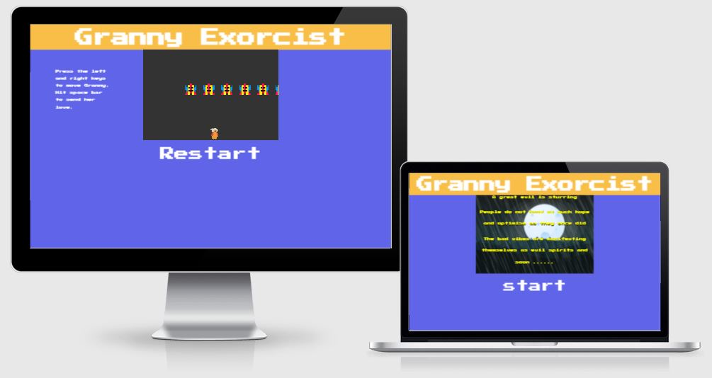

A great evil is sturring 

People do not have as much hope and optimism as they once did.

The bad vibes are manifesting themselves as evil spirits and soon ...... 

They will spill out into our plane of existence.

But all hope is not lost.

There is one person who can save us ..

A hero of an age long past.. the 1960's.

With the ultimate power of love and happiness.

Only she can thwart this great evil.....

She is....

Granny Exorsist

Granny is bursting with love and isn't affraid to use it! 

:heart: :heart: :heart: :heart: :heart: :heart: :heart:

## UX Design
You will start at the landing page, where you can find the story about the game.  
This game is build in retro style with old fashion colors, font family and image styles. 

When you click the start button, you will get directed to the game page. 
The game instructions will be displayed on the left.  
The restart button will restart the game.

Granny is easy to control by sending her from left to right with the keyboard arrows.  
Shooting the :heart: is with the space button.  
The aliens speed up fast to make the game more difficult.

## Features
- Google Font Family: Press Start 2P
- Background color: #6064E8
### Heading
- Background color: #F9BE48
- Text color: #FFFFFF / white
### Landing Page
- Story screen size: 600px 400px, center, top
- Story screen background: image
- Story text color: standard yellow
- Button text color: white
- Button text color hover over: standard yellow
- Start button links to game page
### Game Page
- Game screen size: 600px 400px, center, top
- Game screen background color: black
- Granny image: center, bottom
- Alien images: center, top
- Alien amount: 6
- Aliens move from right to left, top to bottom
- Shooting: heart
- Heart: moves from granny right up
- Button text color: white
- Button text color hover over: standard yellow
- Restart button restarts the game

## Technologies
### Languages
- HTML5
- CSS
- JavaScript
### Frameworks, Libraries & Programs
- GitHub
- GitPod
- Google Fonts
- Iamresponsivedesign

## Testing
- HTML: validator.w3.org
- CSS: jigsaw.w3.org
- JavaScript: beautifytools.com

## Deployment

This game is build for the Retro Game Hackathon of Code Institute. 

The basis is of the retro game Space Invader.  
Instead of killing we decided to make it a positive game, by shooting love / hearts.

See the live website here -> [Granny Exorsist](https://dilner1.github.io/Hackathon_Game_new/)

## Credits

** info

** game basis from...

** images from...